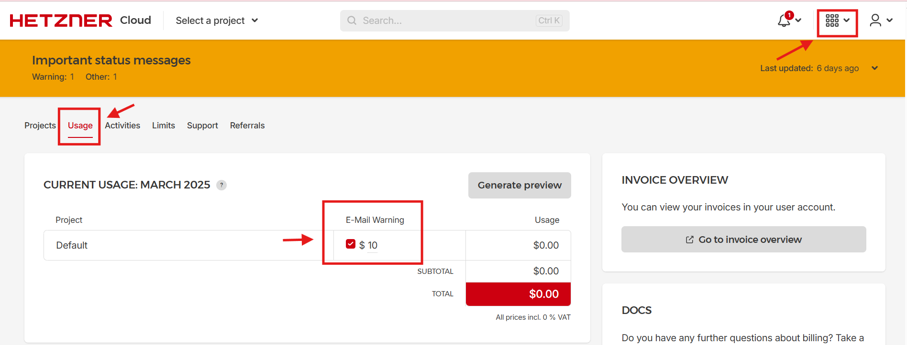

# Setup Oraichain Validator Node
## 1. Prerequisites
* OS: Ubuntu LTS >= 18.04
    * CPU: 4 cores
    * RAM: 8GB

## 2. Set up Cloud server
I choose Hetzner Cloud as my cloud service provider due to its low price and security. 
Go to https://www.hetzner.com/cloud and register an account.  
### 2.1. Register an account
Fill in the form and register an account. 


After setting up all information, you will receive an email from Hetzner to confirm your account. Remember to setup 2FA and save your recovery code in a secured place.  

### 2.2. Set up budget alert
Before spinning up a new server, I suggest creating a budget alert to make sure the cost doesn't exceed your budget.  
Go to Hetzner Cloud > Choose the Usage tab > You will see a tickbox under E-mail Warning. Check that and enter a reasonable amount for your budget..



### 2.3. Add a server
1. Go to tab project > Under Default > Click Create Server.
2. Choose the server's configuration:
- Location
- Image: Ubuntu. I choose the latest LTS version 24.04.
- Type: Shared vCPU (because the workload is not constant and not heavy, this is a cost-efficient option). 
    - Architecture: x86 (Intel/AMD)
    - Name: CX22
    - CPU: 2 vCPU
    - RAM: 4GB
    - SSD: 40GB
    - Price/h: 0.002$/h
    - Price/month: 3.99$/month (Tax not included)
- Networking:
    - IPv4: Primary IP costs $0.001/h, regardless of being attached to a server or not.
- SSH key: Set up a SSH key to connect to the server. The file will be saved in "~/.ssh/" directory.
`ssh-keygen -t ed25519  -C "your_email@example.com"`
- Volume: 100GB SSD ($5/month)
- cloud-init:
```yml
#cloud-config
users:
  - name: hongeinh
    groups: users, admin
    sudo: ALL=(ALL) NOPASSWD:ALL
    shell: /bin/bash
    ssh_authorized_keys:
      - <public ssh key>

packages:
  - fail2ban
  - ufw
  - make
  - gcc
package_update: true
package_upgrade: true
runcmd:
  - printf "[sshd]\nenabled = true\nbanaction = iptables-multiport" > /etc/fail2ban/jail.local
  - systemctl enable fail2ban
  - ufw allow 2222
  - ufw enable
  - sed -i -e '/^\(#\|\)PermitRootLogin/s/^.*$/PermitRootLogin no/' /etc/ssh/sshd_config
  - sed -i -e '/^\(#\|\)PasswordAuthentication/s/^.*$/PasswordAuthentication no/' /etc/ssh/sshd_config
  - sed -i -e '/^\(#\|\)Port/s/^.*$/Port 2222/' /etc/ssh/sshd_config
  - sed -i -e '/^\(#\|\)KbdInteractiveAuthentication/s/^.*$/KbdInteractiveAuthentication no/' /etc/ssh/sshd_config
  - sed -i -e '/^\(#\|\)ChallengeResponseAuthentication/s/^.*$/ChallengeResponseAuthentication no/' /etc/ssh/sshd_config
  - sed -i -e '/^\(#\|\)MaxAuthTries/s/^.*$/MaxAuthTries 2/' /etc/ssh/sshd_config
  - sed -i -e '/^\(#\|\)AllowTcpForwarding/s/^.*$/AllowTcpForwarding no/' /etc/ssh/sshd_config
  - sed -i -e '/^\(#\|\)X11Forwarding/s/^.*$/X11Forwarding no/' /etc/ssh/sshd_config
  - sed -i -e '/^\(#\|\)AllowAgentForwarding/s/^.*$/AllowAgentForwarding no/' /etc/ssh/sshd_config
  - sed -i -e '/^\(#\|\)AuthorizedKeysFile/s/^.*$/AuthorizedKeysFile .ssh\/authorized_keys/' /etc/ssh/sshd_config
  - sed -i '$a AllowUsers hongeinh' /etc/ssh/sshd_config
  - reboot
```

## 3. Install necessary packages
### 3.0. Login to the server and attach volume
- `ssh hongeinh@<server ip>`. Add passphrase when prompted, if any. 
- Login as root user: `sudo su -`
- On your browser, go to the project -> Volume tab > Choose your volume > Show configuration. Hetzner will guide you through the process of attaching the volume to the server. Follow the given commands to attach the volume.

### 3.1. Install Go 
Required version: >= 1.22.3

1. Download the latest Go release from https://golang.org/dl/ with Kind = Linux. Choose relevent chip architecture to your Ubuntu machine. For example, I will download this tarball: `go1.24.2.linux-amd64.tar.gz` 
or `wget https://go.dev/dl/go1.24.2.linux-amd64.tar.gz`


2. Extract the tarball and move it to `/usr/local`. This location is recommended as it is the default location for Go installations and will make version control easier. Use the following commands to extract the tarball and move it to `/usr/local`. Remember to change the file name in the below example to your downloaded file name:
```bash
sudo tar -C /usr/local -xzf go1.24.2.linux-amd64.tar.gz
rm go1.24.2.linux-amd64.tar.gz
```

3. Set up Go environment variables. Add the following lines to your `~/.bashrc` file:
```
export GOPATH="$HOME/go"
export GOROOT="/usr/local/go"
export PATH=$PATH:$GOROOT/bin:$GOPATH/bin
```

Then save the changes with `source ~/.bashrc`

### 3.2 Set up Oraid
1. Create orai_home
```bash
mkdir $HOME/orai_home
echo "export ORAI_HOME=$HOME/orai_home" >> $HOME/.bashrc
source $HOME/.bashrc
```  

In case you want to have orai_home in a mount voume, you can change the path in the above command.
```bash
sudo mkdir /mnt/<volume_name>/orai_home
sudo chown -R $USER:$USER /mnt/<volume>/orai_home
``` 

The above command will create orai_home in your desired volume and add permission for your user to that directory.


2. Clone the Orai repository and build
```bash
cd $ORAI_HOME
git clone https://github.com/oraichain/wasmd
cd wasmd
git switch --detach v0.50.9
make build
```
3. Confirm that the build was successful by running the following command: `oraid version`

### 3.3. Initialize the node
```bash
oraid init peinhguin_validator1 --home $ORAI_HOME/.oraid --chain-id Oraichain  
wget -O $ORAI_HOME/.oraid/config/genesis.json https://raw.githubusercontent.com/oraichain/oraichain-static-files/master/genesis.json
```

### 3.4. Set up Cosmovisor (Optional)
1. Install Cosmovisor
```bash
go install cosmossdk.io/tools/cosmovisor/cmd/cosmovisor@latest
``` 

2. Set up cosmovisor directory
```bash
mkdir -p $ORAI_HOME/.oraid/cosmovisor/genesis/bin
mkdir -p $ORAI_HOME/.oraid/cosmovisor/upgrades
cp $GOPATH/bin/oraid $ORAI_HOME/.oraid/cosmovisor/genesis/bin
```  

3. Set up environment variables 
Add the  following lines to your `~/.bashrc` file:
```bash
# Cosmovisor Setup
export DAEMON_NAME=oraid
export DAEMON_HOME=$ORAI_HOME/.oraid
export DAEMON_ALLOW_DOWNLOAD_BINARIES=false
export DAEMON_LOG_BUFFER_SIZE=512
export DAEMON_RESTART_AFTER_UPGRADE=true
export UNSAFE_SKIP_BACKUP=true
```
Save the changes with `source ~/.bashrc` and check the installation with `cosmovisor version` 

Init cosmovisor with:
```bash 
cosmovisor init $(which oraid)
```

### 3.5. Sync chain data
To sync the chain data, you can use the manual from https://ccvalidators.com/#node-snapshot. Choose Network as Oraichain and choose the latest snapshot.

```bash
sudo apt install wget lz4
URL="https://ccv-s3.nbg1.your-objectstorage.com/SNAPSHOTS/oraichain/Oraichain_56664795.tar.lz4"
cd $ORAI_HOME/.oraid
cp data/priv_validator_state.json ./priv_validator_state.json.tmp
rm -rf data wasm
wget $URL
wget $URL.sha256
echo $(cat $(basename $URL.sha256)) $(basename $URL) | sha256sum --check
lz4 -d $(basename $URL) | tar xvf -
rm data/priv_validator_state.json
mv ./priv_validator_state.json.tmp data/priv_validator_state.json
```

### 3.6. Update Node Configuration
1. Update the `config.toml` file to enable the RPC and API endpoints.
```bash
vim $ORAI_HOME/.oraid/config/config.toml
```

2. Add seeds:
```bash
seeds = "e18f82a6da3a9842fa55769955d694f62f7f48bd@seed1.orai.zone:26656,defeea41a01b5afdb79ef2af155866e122797a9c@seed4.orai.zone:26656,f223f1be06ef35a6dfe54995f05daeb1897d94d7@seed-node.mms.team:42656,8542cd7e6bf9d260fef543bc49e59be5a3fa9074@seed.publicnode.com:26656,fe0a0d46eb5436905bf8465f83d2da5a503bf4eb@mainnet-seed.konsortech.xyz:33165,ade4d8bc8cbe014af6ebdf3cb7b1e9ad36f412c0@seeds.polkachu.com:23356,5f5cfac5c38506fbb4275c19e87c4107ec48808d@seeds.nodex.one:11210,49165f4ef94395897d435f144964bdd14413ea28@seed.orai.synergynodes.com:26656"
```

### 3.7 Run as a Systemd Service
```bash
cat > /tmp/orai.service <<EOF
[Unit]
Description=Oraichain Cosmovisor Node
After=network-online.target

[Service]
User=$USER
Environment="ORAI_HOME=/mnt/volume-hel1-1/orai_home"
Environment="DAEMON_NAME=oraid"
Environment="DAEMON_HOME=${ORAI_HOME}/.oraid"
Environment="DAEMON_RESTART_AFTER_UPGRADE=true"
Environment="DAEMON_ALLOW_DOWNLOAD_BINARIES=false"
Environment="DAEMON_LOG_BUFFER_SIZE=512"
Environment="UNSAFE_SKIP_BACKUP=true"
ExecStart=$GOPATH/bin/cosmovisor run start --home ${ORAI_HOME}/.oraid --minimum-gas-prices=0.001orai
Restart=always
RestartSec=3
LimitNOFILE=infinity
LimitNPROC=infinity

[Install]
WantedBy=multi-user.target
EOF

sudo mv /tmp/orai.service /etc/systemd/system/orai.service
sudo systemctl daemon-reload
sudo systemctl start orai
sudo systemctl enable orai
```

## 4. Create a validator

## 5. Miscellaneous
### 5.1. Log rotation for oraid service
Cosmovisor writes to journalctl by default. To check the log size `journalctl --disk-usage`. To edit journalctl settings, run `sudo vim /etc/systemd/journald.conf` and set the following limits:
```conf
SystemMaxUse=500M         # Max total space journal logs can use
SystemKeepFree=100M       # Leave this much space free on disk
SystemMaxFileSize=100M    # Max size per journal file
SystemMaxFiles=5          # Number of rotated files to keep
```  
Then, run `sudo systemctl restart systemd-journald` to apply the changes.

We can manually rotate the logs by running:
```bash
sudo journalctl --vacuum-time=7d     # keep only 7 days of logs
sudo journalctl --vacuum-size=500M   # keep only 500MB max
```

### 5.2. Node Monitoring
Add node monitoring to the current node to constantly checkk the node's health, as well as the attached volume.
#### 5.2.1. Deploying a Node Metrics Exporter
1. Go to the [Node Exporter GitHub Releases](https://github.com/prometheus/node_exporter/releases) page and download the latest binary for your architecture.
```bash
wget https://github.com/prometheus/node_exporter/releases/download/v1.9.1/node_exporter-1.9.1.linux-amd64.tar.gz
tar xvfz node_exporter-1.9.1.linux-amd64.tar.gz
sudo cp node_exporter-1.9.1.linux-amd64/node_exporter /usr/local/bin/
```  

2. Set up the node exporter service with systemd `/etc/systemd/system/node_exporter.service`:
```conf
[Unit]
Description=Prometheus Node Exporter
Wants=network-online.target
After=network-online.target

[Service]
User=nobody
Group=nogroup
ExecStart=/usr/local/bin/node_exporter
Restart=always

[Install]
WantedBy=default.target
```
Then reload systemd, enable the service and start it:
```bash
sudo systemctl daemon-reload
sudo systemctl start node_exporter
sudo systemctl enable node_exporter
```

3. Visit metrics at `curl http://localhost:9100/metrics`

#### 5.2.2. Deploying a Prometheus Server
1. Download the latest Prometheus release from the [Prometheus GitHub Releases](https://github.com/prometheus/prometheus/releases) page.
```bash
wget https://github.com/prometheus/prometheus/releases/download/v3.2.1/prometheus-3.2.1.linux-386.tar.gz
tar xvfz prometheus-3.2.1.linux-386.tar.gz
mv prometheus-3.2.1.linux-386/ prometheus_home
cd prometheus_home

```  
2. Edit the `prometheus.yml` file to add the node exporter as a target:
```conf
global:
  scrape_interval: 15s

scrape_configs:
  - job_name: 'node_exporter'
    static_configs:
      - targets: ['localhost:9100']
```  
3. Start the Prometheus server: `./prometheus --config.file=prometheus.yml --web.listen-address=":9091"` use a different port because orai is already using port 9090.  ==> for testing purpose only. For production, create a systemd service.

4. Create a systemd service for Prometheus with `sudo vim /etc/systemd/system/prometheus.service`:
```bash
[Unit]
Description=Prometheus Monitoring
After=network.target

[Service]
User=nobody
ExecStart=/home/hongeinh/prometheus_home/prometheus \
  --config.file=/home/hongeinh/prometheus_home/prometheus.yml \
  --web.listen-address=:9091 \
  --storage.tsdb.path=/home/hongeinh/prometheus_home/data

Restart=on-failure

[Install]
WantedBy=multi-user.target
```

5. Reload systemd, enable the service and start it:
```bash
sudo systemctl daemon-reload
sudo systemctl enable prometheus
sudo systemctl start prometheus

# check logs and status
sudo systemctl status prometheus
journalctl -u prometheus -f

```
#### 5.2.3. Deploying Grafana
1. Install Grafana:
```bash
sudo apt-get install -y apt-transport-https
sudo apt-get install -y software-properties-common wget
wget -q -O - https://packages.grafana.com/gpg.key | sudo apt-key add -
echo "deb https://packages.grafana.com/oss/deb stable main" | sudo tee -a /etc/apt/sources.list.d/grafana.list
sudo apt-get update
sudo apt-get install grafana
```  
2. Start the Grafana service:
```bash
sudo systemctl start grafana-server
sudo systemctl enable grafana-server
sudo systemctl status grafana-server
sudo ufw allow 3000
```